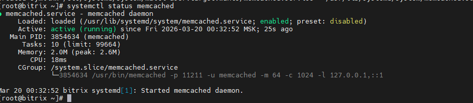
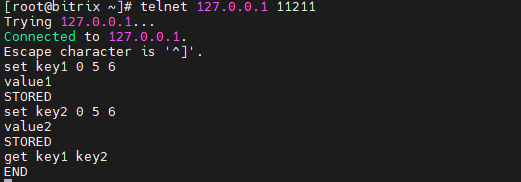
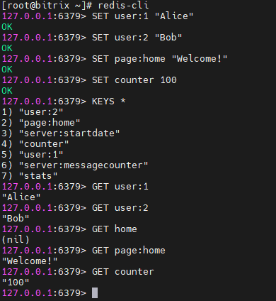

Домашнее задание к занятию «Кеширование Redis/memcached» Ражев М.Н

## Задание 1. Кеширование

Приведите примеры проблем, которые может решить кеширование.

Приведите ответ в свободной форме.    
 
**Ответ**

Кеширование — это технология, которая помогает решать широкий спектр проблем, связанных со скоростью работы, нагрузкой на инфраструктуру и стабильностью сервисов. По сути, это сохранение копии данных в быстром доступе, чтобы при повторном запросе не выполнять тяжелую работу заново.

Вот основные категории проблем, которые решает кеширование:

1. Высокая нагрузка на базы данных (БД)
Это самая частая проблема. Чтение с диска (особенно сложные запросы с JOIN или агрегацией) — операция дорогая.

2. Долгое время ответа сервера (Latency)
Проблема, когда сервер обрабатывает запрос слишком долго, из-за чего пользователи уходят или падает конверсия.

3. Проблемы с масштабированием при пиковых нагрузках
Когда на сайт внезапно приходит в 100 раз больше людей, чем обычно, серверы могут не выдержать.

4. Нестабильность или дороговизна внешних ресурсов
Если ваш сервис зависит от внешних API (погода, курсы валют, данные соцсетей).

-----------------------------------------------------------------------------------

## Задание 2. Memcached

1. Установите и запустите memcached.

Приведите скриншот systemctl status memcached, где будет видно, что memcached запущен.  
  
**Ответ**

Скриншот 1: с результатом

-----------------------------------------------------------------------------------

Задание 3. Удаление по TTL в Memcached

1. Запишите в memcached несколько ключей с любыми именами и значениями, для которых выставлен TTL 5.

Приведите скриншот, на котором видно, что спустя 5 секунд ключи удалились из базы.
  
**Ответ**

Скриншот 1: с результатом

-----------------------------------------------------------------------------------

## Задание 4. Запись данных в Redis

1. Запишите в Redis несколько ключей с любыми именами и значениями.

Через redis-cli достаньте все записанные ключи и значения из базы, приведите скриншот этой операции. 
  
**Ответ**

Скриншот 1: с результатом работы утилиты

-----------------------------------------------------------------------------------

