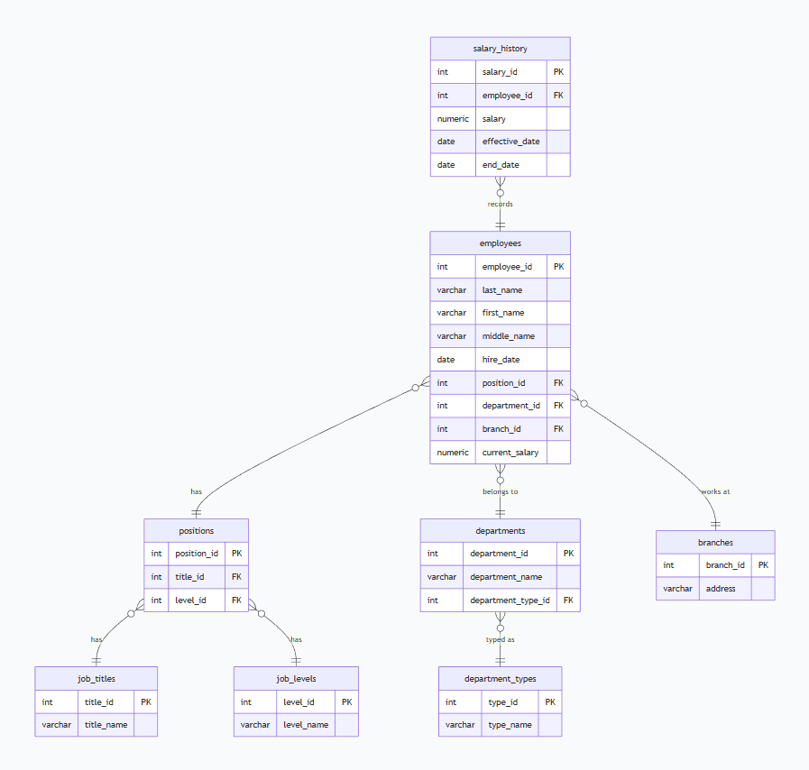

Домашнее задание к занятию «Базы данных» Ражев М.Н

Легенда
Заказчик передал вам файл в формате Excel, в котором сформирован отчёт.

На основе этого отчёта нужно выполнить следующие задания.

## Задание 1.

Опишите не менее семи таблиц, из которых состоит база данных. Определите:

какие данные хранятся в этих таблицах,
какой тип данных у столбцов в этих таблицах, если данные хранятся в PostgreSQL.
Начертите схему полученной модели данных. Можете использовать онлайн-редактор: https://app.diagrams.net/

Этапы реализации:

Внимательно изучите предоставленный вам файл с данными и подумайте, как можно сгруппировать данные по смыслу.
Разбейте исходный файл на несколько таблиц и определите список столбцов в каждой из них.
Для каждого столбца подберите подходящий тип данных из PostgreSQL.
Для каждой таблицы определите первичный ключ (PRIMARY KEY).
Определите типы связей между таблицами.
Начертите схему модели данных. На схеме должны быть чётко отображены:
все таблицы с их названиями,
все столбцы с указанием типов данных,
первичные ключи (они должны быть явно выделены),
линии, показывающие связи между таблицами.
Результатом выполнения задания должен стать скриншот получившейся схемы базы данных.  
 
**Ответ**

Скриншот 1: с результатом

-----------------------------------------------------------------------------------

## Задание 2.

  
**Ответ**

SQL-скрипт для создания базы данных

-- Создание базы данных (если не существует)
CREATE DATABASE company_db;

-- Подключаемся к созданной базе (выполняется отдельно)
\c company_db;

-- Таблица должностей (базовые названия)
CREATE TABLE job_titles (
    title_id SERIAL PRIMARY KEY,
    title_name VARCHAR(100) UNIQUE NOT NULL
);

-- Таблица уровней должностей
CREATE TABLE job_levels (
    level_id SERIAL PRIMARY KEY,
    level_name VARCHAR(50) UNIQUE NOT NULL
);

-- Таблица типов подразделений
CREATE TABLE department_types (
    type_id SERIAL PRIMARY KEY,
    type_name VARCHAR(50) UNIQUE NOT NULL
);

-- Таблица филиалов
CREATE TABLE branches (
    branch_id SERIAL PRIMARY KEY,
    address VARCHAR(300) UNIQUE NOT NULL
);

-- Таблица позиций (связь должности и уровня)
CREATE TABLE positions (
    position_id SERIAL PRIMARY KEY,
    title_id INTEGER NOT NULL REFERENCES job_titles(title_id) ON DELETE RESTRICT,
    level_id INTEGER NOT NULL REFERENCES job_levels(level_id) ON DELETE RESTRICT,
    UNIQUE(title_id, level_id)
);

-- Таблица структурных подразделений
CREATE TABLE departments (
    department_id SERIAL PRIMARY KEY,
    department_name VARCHAR(200) NOT NULL,
    department_type_id INTEGER NOT NULL REFERENCES department_types(type_id) ON DELETE RESTRICT
);

-- Таблица сотрудников
CREATE TABLE employees (
    employee_id SERIAL PRIMARY KEY,
    last_name VARCHAR(100) NOT NULL,
    first_name VARCHAR(100) NOT NULL,
    middle_name VARCHAR(100),
    hire_date DATE NOT NULL,
    position_id INTEGER NOT NULL REFERENCES positions(position_id) ON DELETE RESTRICT,
    department_id INTEGER NOT NULL REFERENCES departments(department_id) ON DELETE RESTRICT,
    branch_id INTEGER NOT NULL REFERENCES branches(branch_id) ON DELETE RESTRICT,
    current_salary NUMERIC(10,2) NOT NULL CHECK (current_salary > 0)
);

-- Таблица истории изменения окладов
CREATE TABLE salary_history (
    salary_id SERIAL PRIMARY KEY,
    employee_id INTEGER NOT NULL REFERENCES employees(employee_id) ON DELETE CASCADE,
    salary NUMERIC(10,2) NOT NULL CHECK (salary > 0),
    effective_date DATE NOT NULL,
    end_date DATE,
    CHECK (end_date IS NULL OR end_date > effective_date)
);

-- Индексы для ускорения поиска по внешним ключам (опционально)
CREATE INDEX idx_employees_position ON employees(position_id);
CREATE INDEX idx_employees_department ON employees(department_id);
CREATE INDEX idx_employees_branch ON employees(branch_id);
CREATE INDEX idx_salary_history_employee ON salary_history(employee_id);
CREATE INDEX idx_positions_title ON positions(title_id);
CREATE INDEX idx_positions_level ON positions(level_id);
CREATE INDEX idx_departments_type ON departments(department_type_id);

Скриншот 2: с результатом

-----------------------------------------------------------------------------------

