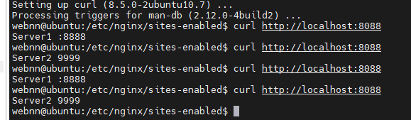
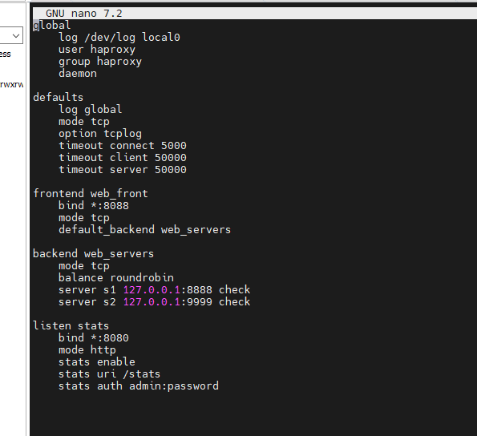
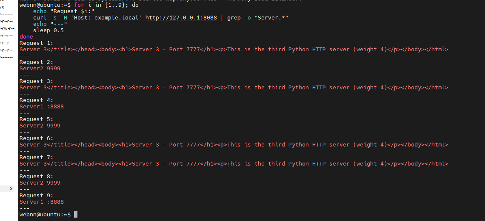
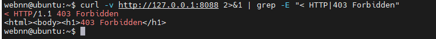
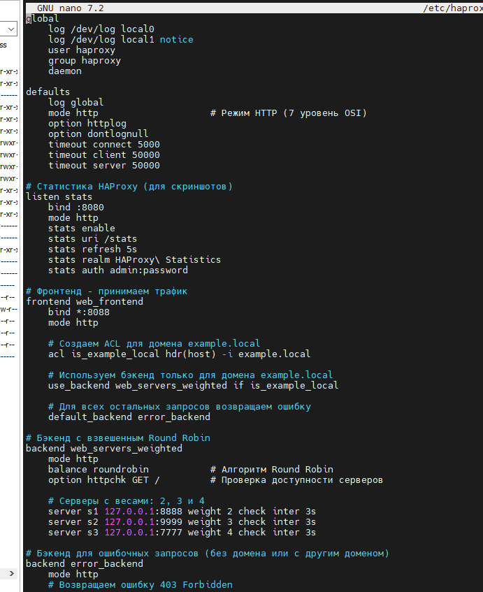

# Домашнее задание к занятию 2 «Кластеризация и балансировка нагрузки» Ражев М.Н

## Задание 1

1. Запустите два simple python сервера на своей виртуальной машине на разных портах
2. Установите и настройте HAProxy, воспользуйтесь материалами к лекции по ссылке
3. Настройте балансировку Round-robin на 4 уровне.
4. На проверку направьте конфигурационный файл haproxy, скриншоты, где видно перенаправление запросов на разные серверы при обращении к HAProxy.
   
 
**Ответ**

Скриншот конфигурационного файла haproxy

Скриншот перенаправления запросов

-----------------------------------------------------------------------------------

## Задание 2

1. Запустите три simple python сервера на своей виртуальной машине на разных портах 
2. Настройте балансировку Weighted Round Robin на 7 уровне, чтобы первый сервер имел вес 2, второй - 3, а третий - 4
3. HAproxy должен балансировать только тот http-трафик, который адресован домену example.local
4. Добавьте Zabbix Agentов в раздел Configuration > Hosts вашего Zabbix Servera
5. На проверку направьте конфигурационный файл haproxy, скриншоты, где видно перенаправление запросов на разные серверы при обращении к HAProxy c использованием домена example.local и без него.
   
  
**Ответ**

Скриншот 1: Запросы к домену example.local (с балансировкой по весам)

Скриншот 2: Запрос без домена (должна быть ошибка)

Скриншот 3: конфигурационного файла haproxy

-----------------------------------------------------------------------------------
